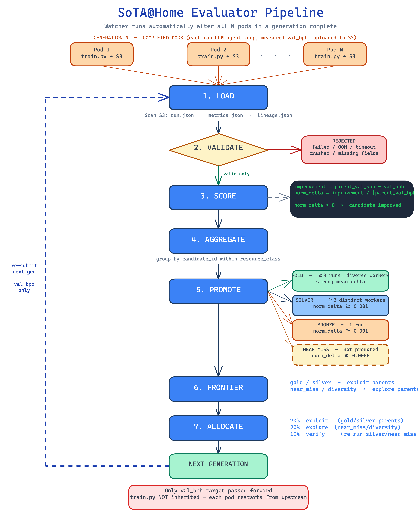

# SoTA@Home

**Distributed agentic ML research on contributed GPU hardware.**

SoTA@Home is a self-improving training loop that runs across volunteer GPU nodes. Each node joins the cluster, pulls training jobs, and contributes results back. An evaluator pipeline promotes candidates through Bronze → Silver → Gold based on reproducible improvement, then automatically seeds the next generation from the best parents — compounding improvements across generations.

Conceptually similar to [SETI@Home](https://setiathome.berkeley.edu/), but for modern agentic ML workloads.

---

## How it works

```
Submit job
    │
    ▼
┌─────────────────────────────────────────────────────────┐
│  Orchestration Server  (orchestration/server.py)         │
│                                                          │
│  POST /submit ──► Redis queue ──► k8s Job per pod        │
│                                       │                  │
│                              one GPU pod per assignment  │
└─────────────────────────────────────────────────────────┘
                                        │
                    ┌───────────────────┴────────────────────┐
                    ▼                   ▼                     ▼
              Pod 1                  Pod 2                  Pod N
         (parent A, exploit)   (parent A, verify)    (parent B, explore)
              │                        │                     │
         train, measure           train, measure        train, measure
         upload artifacts         upload artifacts      upload artifacts
              │                        │                     │
              └───────────────────┬────┘─────────────────────┘
                                  ▼
┌─────────────────────────────────────────────────────────┐
│  Generation Watcher  (evaluator/watcher.py)              │
│                                                          │
│  counts run.json uploads ──► all done ──► evaluate       │
│                                               │          │
│                              promote → frontier → alloc  │
│                              write evaluations/ to S3    │
│                              generate report.zip         │
│                              submit next generation      │
└─────────────────────────────────────────────────────────┘
```

Each generation:
1. **Pods run** — each pod gets a specific parent `train.py` and runs the autoresearch agent loop
2. **Artifacts uploaded** — `run.json`, `metrics.json`, `lineage.json`, `train.py` → MinIO
3. **Evaluator fires** — validate → score → aggregate → promote → build frontier → allocate next jobs
4. **Report generated** — `report.zip` with markdown + charts uploaded to S3
5. **Next generation submitted** — each next-gen pod gets its own parent assignment (exploit / explore / verify)

---

## Evaluator Pipeline

The evaluator decides which candidates are worth continuing from, and how:



### Promotion tiers

| Tier | Requirement |
|---|---|
| **Bronze** | ≥1 valid run with `normalized_delta ≥ 0.001` |
| **Silver** | Bronze + reproduced across ≥2 distinct workers **or** ≥2 distinct seeds |
| **Gold** | Silver + ≥3 improved runs + strong mean delta |

Frontier candidates are assigned roles that shape next-generation job types:

| Role | Source | Job type in next gen |
|---|---|---|
| `gold` / `silver` | Promoted candidates | 70% exploit |
| `near_miss` | High-scoring non-bronze | 20% explore |
| `diversity` | Low-metric-variance candidates | 20% explore + 10% verify |

---

## Generation Report

After each generation, `evaluator/report.py` produces a `report.zip` containing a markdown summary and charts. Example output:

```
# SoTA@Home Generation Report: b7d4e823
Generated: 2026-03-15T02:11:38Z

## Executive Summary
- Runs: 5 total, 5 valid, 3 improved
- Promotions: 2 bronze, 1 silver, 0 gold
- Best candidate: 11f83a90 — val_bpb=2.7801

## Promotion Funnel
  Total      ████████████████████  5
  Valid      ████████████████████  5
  Improved   ████████████          3
  Bronze     ████████              2
  Silver     ████                  1
  Gold       ░                     0

## Lineage
  [c7e1a4b2] ──► [11f83a90] ★ SILVER  val_bpb=2.7801
             ──► [29c07b1e] ◆ bronze  val_bpb=2.8070
             ──► [3ad15f62] ◆ bronze  val_bpb=2.8036
  [d9b3f501] ──► [5cf43e71] · none    val_bpb=2.8175
```

See [`docs/example-report.md`](docs/example-report.md) for two fully annotated example reports (gen 1 seed run + gen 2 with promotions). See [`docs/report-format.md`](docs/report-format.md) for zip layout and image descriptions.

Reports are uploaded to `s3://runs/reports/{gen_id}/report.zip` automatically. To regenerate manually:

```bash
export S3_ENDPOINT_URL=http://minio:9000
export S3_ACCESS_KEY=minioadmin
export S3_SECRET_KEY=minioadmin

python3 -m evaluator.report_cli --gen-id <gen_id>
# or skip upload:
python3 -m evaluator.report_cli --gen-id <gen_id> --no-upload --output-dir /tmp/report
```

---

## Repository Layout

```
orchestration/        FastAPI server, Redis queue, k8s deployer, generation watcher
  server.py           POST /submit, GET /cluster_status, watcher thread startup
  k8s_deployer.py     Creates Kubernetes Jobs; one pod per job assignment
  agent.py            LLM-based InitContainerSpec generator
  models.py           AutoresearchJobRequest, JobAssignment, ResearchItem, …
  settings.py         Env-var config

evaluator/            Evaluation pipeline (runs after each generation)
  loader.py           MinIO artifact loader
  validate.py         Run eligibility checks
  score.py            Parent-relative delta scoring
  aggregate.py        Aggregate by (candidate_id, resource_class)
  promote.py          Bronze / Silver / Gold decisions
  frontier.py         Frontier role assignment
  allocate.py         Next-gen job allocation (exploit / explore / verify)
  watcher.py          Generation polling loop; triggers evaluation and re-submit
  report.py           Report generation (charts + markdown + zip + upload)
  report_cli.py       Standalone CLI: python3 -m evaluator.report_cli

docker/               autoresearch-worker image
  Dockerfile          CUDA 12.8 + torch 2.9.1, wraps karpathy/autoresearch
  entrypoint.sh       10-phase entrypoint: validate → prepare → train → upload

docs/                 Design docs (see table below)
join.sh               Worker node bootstrap script
scripts/              build.sh, prepare-cache.sh, run.sh
infra/                Pulumi deployment
```

---

## Quick start — contributing a node

```bash
# Bootstrap the worker node
./join.sh

# With package install permission (non-interactive)
./join.sh --dangerously-skip-permissions
```

---

## Quick start — submitting a research job

```bash
# 5 pods, 3 generations, 10 agent iterations each, 5-minute budget per pod
curl -X POST http://<orchestrator>:8000/submit \
  -H "Content-Type: application/json" \
  -d '{
    "n": 5,
    "generations": 3,
    "m": 10,
    "t": 300,
    "dataset_hf_repo": "roneneldan/TinyStories",
    "research_direction": "Minimize val_bpb with improved learning rate schedule"
  }'

# Check progress
curl http://<orchestrator>:8000/cluster_status | jq '.generations'
```

---

## S3 artifact layout

```
s3://runs/
  generations/{gen_id}/{run_id}/
    run.json          operational metadata
    metrics.json      primary metric (val_bpb)
    lineage.json      parent candidate linkage
    train.py          final mutated training script
  evaluations/{gen_id}/
    runs.json  aggregates.json  promotions.json
    frontier.json  next_jobs.json  allocation_summary.json
  reports/{gen_id}/
    report.zip        single.md + images/
  agents/{gen_id}/
    agent.py          custom agent script (if supplied at submit time)
```

See [`docs/storage-upload.md`](docs/storage-upload.md) for the full key reference.

---

## Hardware

Current cluster: single RTX 2060 12 GB node ("turtle"), k3s, MinIO on-node.

| Resource class | GPU | VRAM |
|---|---|---|
| `2060-12gb` | RTX 2060 | 12 GB |
| `3090-24gb` | RTX 3090 | 24 GB |
| `H100-80gb` | H100 SXM | 80 GB |

Evaluator decisions are scoped per resource class — no cross-hardware metric comparisons.

---

## Docs

| Doc | Description |
|---|---|
| [`docs/orchestration.md`](docs/orchestration.md) | API reference, lifecycle, Redis/S3 layout |
| [`docs/evaluation.md`](docs/evaluation.md) | Evaluator pipeline detail |
| [`docs/promotion-policy.md`](docs/promotion-policy.md) | Bronze/Silver/Gold thresholds and rationale |
| [`docs/autoresearch-worker.md`](docs/autoresearch-worker.md) | Worker image, env vars, entrypoint phases |
| [`docs/reporting.md`](docs/reporting.md) | Report generation end-to-end |
| [`docs/report-format.md`](docs/report-format.md) | Report zip contents and image descriptions |
| [`docs/storage-upload.md`](docs/storage-upload.md) | S3 key reference |
| [`docs/example-report.md`](docs/example-report.md) | Two annotated example generation reports |
| [`docs/artifact-contract.md`](docs/artifact-contract.md) | Per-run artifact schemas |
| [`docs/next-iteration.md`](docs/next-iteration.md) | Frontier and allocation design |
| [`AGENTS.md`](AGENTS.md) | Guidance for coding agents working in this repo |
